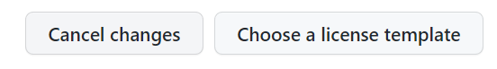

# Frequently Asked Questions

<details open markdown="block">
  <summary>
    Table of contents
  </summary>
  {: .text-delta }
1. TOC
{:toc}
</details>

## How do I change the font size of the whole website?

If you want to alter the default font size globally, [documentation](https://labsyspharm.github.io/just-the-docs-lsp/docs/utilities/typography/#global-font-size-adjustments){:target="_blank"} for the LSP/HiTS theme provides details instructions. 

[View Documentation Here](https://labsyspharm.github.io/just-the-docs-lsp/docs/utilities/typography/#global-font-size-adjustments){: .btn .btn-arrow }{:target="_blank"}

Briefly, here are the steps:

1. Make a new color scheme file (with the extention `.scss`) under `docs/_sass/color_schemes/`
2. Copy and paste the content of your chosen color scheme from the theme repository into your new color scheme file - this will tell the theme to keep using the same colors and other settings
3. In your new color scheme file, override the font sizes with lines like these:

```
$body-font-size: fs-3;
$h2-font-size: fs-8;
# h2 refers to the level 2 heading
```
4. Call your new color scheme file in `_config.yml`
```
color_scheme: NEW_SCHEME_FILE_NAME
```

## How do I change the size of an embedded image?

There are a few ways to insert an image and scale its size. Not all the Markdown solutions I've come across online are supported by GitHub Pages. One method that works is to use a little HTML instead of Markdown.

```
 
```
or
```

```

Note that `alt=` is setting the alternative text for the image, when the image cannot be viewed for any reason. 

As an example, here's the same image inserted at the orginal size and then scaled smaller:
```


```

  


## How do I exclude a page from showing up in navigation?
          
You may want to exclude some pages from navigation and only lead viewers to them via links. To accomplish this, you can add the property `nav_exclude` in the front matter of that page and set it to `true`:

```
---
nav_exlude: true
---
```

## How do I create a link that opens a new tab by default?

You can use the following addition to the link syntax:
```
[new tab link](https://mcmicro.org/){:target="_blank"}
```
It should render: [new tab link](https://mcmicro.org/){:target="_blank"}

## How do I change the license of my website? What about adding a license?

The blank website template comes with a `LICENSE` file in the root directory. It is set to a Creative Commons Zero v1.0 Universal license. 

To change the type of license, simply edit (pencil icon) the `LICENSE` file. GitHub will prompt you to **Choose a licence template**



Most software/code-related work product of LSP and HiTS are released under the [MIT license](https://choosealicense.com/licenses/mit/){:target="_blank"}. Another type of commonly used licenses is the Creative Commons licenses, which you can read about on the [Creative Common website](https://creativecommons.org/about/cclicenses/){:target="_blank"}. Finally, [Choose a License](https://choosealicense.com/){:target="_blank"} is a helpful resource to learn about available license templates and choose a license based on your situation.

To add a new license to your repository, you can add a new file titled `LICENSE` on GitHub. You will be prompted to choose from a list of license templates.

## I am trying to preview my site locally and hit an error on `bundle install` - what now?

These errors are often caused by gem dependency issues. You may need to update the `Gemfile` to reflect the version of Ruby your system is running. 

You can check your system's Ruby version with
```
ruby -v
```

The `Gemfile` will tell you the versions of your site is trying to utilize:

```
source "https://rubygems.org"

gem "jekyll", "~> 2.5"

# To upgrade, run `bundle update github-pages`.
gem "github-pages", "~>227", group: :jekyll_plugins

# If you have any plugins, put them here!
group :jekyll_plugins do
  gem "jekyll-feed", "~> 0.15"
  gem "jekyll-include-cache"
end

```

This `Gemfile` calls for Jekyll version 2.5 and Github Pages version 227. By referencing the [dependencies for Github Pages](https://pages.github.com/versions/){:target="_blank"}, we can see that Github Pages version 227 uses Jekyll version 3.9.2. 

We can then revise our `Gemfile` to include
```
gem "jekyll", "~> 3.9.2"
```

and re-run 
```
bundle install
```

to see if this corrects the issue. 