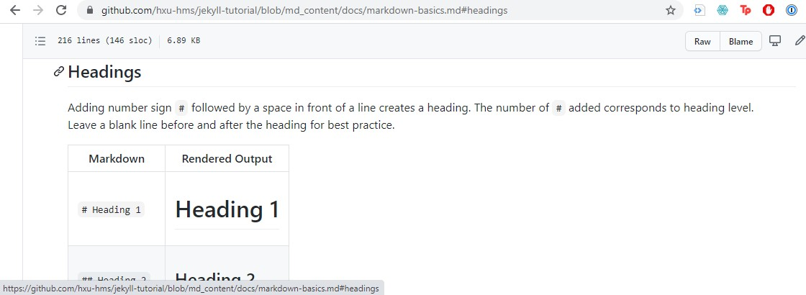

# Markdown Basic Syntax

This page will give you a quick guide through some of the Markdown syntax that you may use to edit your `.md` files. If you are editing in GitHub, the Preview button on top of the editing window allows you to view basic Markdown contents before you commit to the changes (Jekyll-specific features are not supported).

For extra resources on Markdown syntax and editing Markdown on GitHub, these following resources may be helpful:
1. [Basic Writing and Formatting Syntax on GitHub](https://docs.github.com/en/github/writing-on-github/getting-started-with-writing-and-formatting-on-github/basic-writing-and-formatting-syntax)
2. [Markdown Guide: Basic Markdown Syntax](https://www.markdownguide.org/basic-syntax/)
3. [Markdown Guide: Extended Syntax](https://www.markdownguide.org/extended-syntax/)
4. [Daring Fireball: Markdown Syntax](https://daringfireball.net/projects/markdown/syntax)

## Headings

Adding number sign `#` followed by a space in front of a line creates a heading. The number of `#` added corresponds to heading level.  
Leave a blank line before and after the heading for best practice. 

| Markdown | Rendered Output |
|----------|-----------------|
| `# Heading 1`| <h1> Heading 1 </h1> |
|`## Heading 2`| <h2> Heading 2 </h2> |
|`### Heading 3`| <h3> Heading 3 </h3> |

## Paragraph breaks

To break between paragraphs, use a blank line to seprate the paragraphs.

| Markdown | Rendered Output |
|----------|-----------------|
| <p>`This is the first paragraph.`</p> <p>`This is the second paragraph.`</p>| <p>This is the first paragraph.</p> <p>This is the second paragraph.</p> |

## Line breaks

To create a line break, end a line with two or more spaces, then type return.

| Markdown | Rendered Output |
|----------|-----------------|
|`This is the first line.   `<br> `This is the second line.`|This is the first line.<br> This is the second line.|

## Bold

Use two asterisks before and after a word of phrase to make it **bold**.

| Markdown | Rendered Output |
|----------|-----------------|
|`This is **bold**`|This is **bold**|

## Italic

Use one asterisk before and after a word or phrase to italicize it. 

| Markdown | Rendered Output |
|----------|-----------------|
|`This is *italic*`|This is *italic*|

## Lists

### Ordered lists

Use number followed by a period and a space for line items in an ordered list. When editing in GitHub, numbers will autofill in numeric order. When editing locally, numbers don't have to follow numeric order, but lists should start at number 1.  

| Markdown | Rendered Output |
|----------|-----------------|
|`1. item`<br>`2. item`<br>`3. item`|<ol><li>item</li> <li>item</li> <li>item</li></ol>|

When editing in GitHub, add two `tab` to start a nested list. For example,

```
1. one
2. two
   1. sub-one
   2. sub-two
```

will render

1. one
2. two
    1. sub-one
    2. sub-two

## Unordered lists

Use dash `-`, asterisk `*`, or plus sign `+` followed by space in front of an item in an unordered list. When editing in GitHub, GitHub will autofill the sign after the first item is entered.

| Markdown | Rendered Output |
|----------|-----------------|
|`- one`<br> `- two`<br> `- three`|<ul><li>one</li> <li>two</li> <li>three</li></ul>|

Use one `tab` to create a nested unordered list on GitHub. For example

```
- one
- two
  - sub-one
  - sub-two
```

will render

- one
- two
  - sub-one
  - sub-two

## Codes

Use backtick ` to enclose codes. Use ``` to enclose blocks of code.

| Markdown | Rendered Output |
|----------|-----------------|
|`` `code` ``| `code`|

And for example

`` ``` `` <br>
```a block of code ```<br>
```all code ``` <br>
`` ``` ``

would render

```
a block of code
all code
```

To show backticks `` ` `` in code, surround the portion of code that would include backticks in double backticks. (Yes, this is confusing. Use Preview a lot to check your work here)

| Markdown | Rendered Output |
|----------|-----------------|
|``` `` ` `` ```| `` ` ``|

## Links

To create an inline link, use `[ ]` to wrap the link text, followed by the URL/navigation to the linked content in `( )`. 

### Absolute links

For linking to external content, an absolute link should be used. In this instance, the `( )` contains the full URL of the linked content. However, this is not the best option for linking to in-site content, since the URL may change during editing. For example, the following is an absolute link

```
This website is created with [Jekyll](https://jekyllrb.com)
```
will render:

This website is created with [Jekyll](https://jekyllrb.com)

### Relative links

Relative links only works for linking to pages in the same website/repository. It is relative to the current file you are editing. For example, linking to a different page on this website could look like this:

```
Check out the [quick start](./quick-start.md) page of this website.
```
will render:

Check out the [quick start](./quick-start.md) page of this website.

You can use link operands such as `./` and `../` to indicate current directory and parent directory respectively.

### Section links

You can also directly link to a section within a page by hovering over or clicking on the section heading to expose the link. For example, hovering or clicking on "Headings" reveals the link to that section on the bottom and in the address bar.



## Images

To add an image, use an exclamation mark `!`, followed by alt text for the image in square brackets `[ ]`, and the path or URL to the image in parentheses `( )`.

```

```
)
will render


### Linked images

If you want to add a link to an image, enclose the entire Markdown expression for the image in square brackets `[ ]` and then add the link path/URL in parentheses `( )`.

```
[](https://en.wikipedia.org/wiki/Santiago_Ram%C3%B3n_y_Cajal)
```
will render

[](https://en.wikipedia.org/wiki/Santiago_Ram%C3%B3n_y_Cajal)

## Simple tables

To generate a simple table, use pipes `|` to delineate columns and three or more hyphens `---` to create each column's header. For example
```
| Column 1 | Column 2|
|--------|--------|
|adding an item | adding another item |
```
will render
| Column 1 | Column 2|
|--------|--------|
|adding an item | adding another item |

As you can see above, the lengths of the cells do not have to be the same.

## Ignore Markdown formatting

In general, you can intentially ignore Markdown formatting by adding a backslash `\` before the character you are trying to ignore. For example

| Markdown | Rendered Output |
|----------|-----------------|
|`Do not \*format this\*.`|Do not \*format this\*.|
