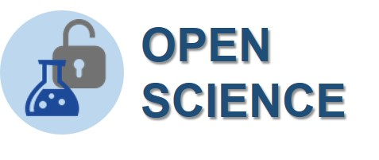
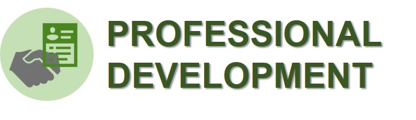

# Why would I make a website?

Open science is the movement to make scientific research and data accessible to all. Open science campaigns for open-access publicatons, archives and data repositories. 

{: .text-center }
**Making a public-facing website to showcase your research is one of the best ways to participate in the open science movement!**

{: .fs-3 }
{: .text-center}
Learn more about [open science and open access](https://datamanagement.hms.harvard.edu/access/open-access){:target="_blank"} from the Harvard Longwood Medical Area Research [Data Management Working Group](https://datamanagement.hms.harvard.edu/){:target="_blank"}.

{: .text-center}
> \[Making a website] is a relatively small investment of time that can pay off in terms of career progress, giving researchers greater control over how their expertise is presented online. It can also help researchers attract PhD students, share resources with the scientific community and promote their work to the general public.
> 
> _--- Andy Tay, Build-your-own website for scientists, Nature Index News, May 2020_

{: .fs-3 }
{: .text-center}
Hear more perspectives and tips from researchers that has made a research website for [personal](https://www.natureindex.com/news-blog/build-your-own-academic-website-for-scientists-researchers-phd){:target="_blank"} career development or for their [lab](https://www-nature-com.ezp-prod1.hul.harvard.edu/articles/d41586-020-01298-5){:target="_blank"}. 

# Why should I use Jekyll?

That's a fair question! Jekyll has a number of strengths as a website design and build tool. One main advantage is that Jekyll is a _static_ website generator, which means that instead of relying on software and databases running on a server, it only needs a directory of files. This means that there are fewer components to create and maintain. The simplicity of Jekyll sites allows you to launch your website more quickly and enjoy longer term website stability compared to dynamic websites. 

## Integration with Git and GitHub Pages

Because Jekyll websites are a directory of files, you can store your entire website on a [GitHub](https://github.com){:target="_blank"} repository! Working in a Git repository has [many benefits](https://www.atlassian.com/git/tutorials/why-git){:target="_blank"} including version control and easy collaboration. 

GitHub will also host your Jekyll website for free in [GitHub Pages](https://pages.github.com/){:target="_blank"}! You can either edit directly through GitHub.com (and have no need to install any additional software on your computer), or you can follow our installation instructions and edit on your local computer. *Visit [tutorial](../tutorial) to get started!*

## Some downsides and how we can help

Of course, nothing is without its drawbacks. We've developed this tutorial and the associated templates to help mitigate any potential downsides of working with Jekyll.

- **Jekyll does not have a built-in graphical user interface (GUI)**
  
  {: .fs-3 }
  Jekyll is a command-line tool, which could seem overwelming to non-technical users. Using the LSP templates eliminates the need to use Jekyll command lines. The websites require using some formatting languages like Markdown and YAML, which can still be disorienting. We recommend checking out our pages on [Markdown](../markdown-basic) and [YAML](../yaml) basics that are most useful while building a Jekyll website. There are additional learning resources linked in those pages as well, if you want to learn more about these languages.
  
- **Jekyll has relatively few themes**

  {: .fs-3 }
  Jekyll has a growing number of publicly available themes, but not all of them are designed for an academic website. For LSP members, we have a theme tailor made for showcasing your research. You can choose between a _software tool_ based template or a _publication_ based template. Check out our page on themes to find out more.

- **Jekyll has a smaller community to offer support (than WordPress for example)**

  {: .fs-3 }
  Fear not! In our [Contacts](../contacts#getting-help) page, you can find ways to contact people within LSP that can offer you technical support when you need them. 
