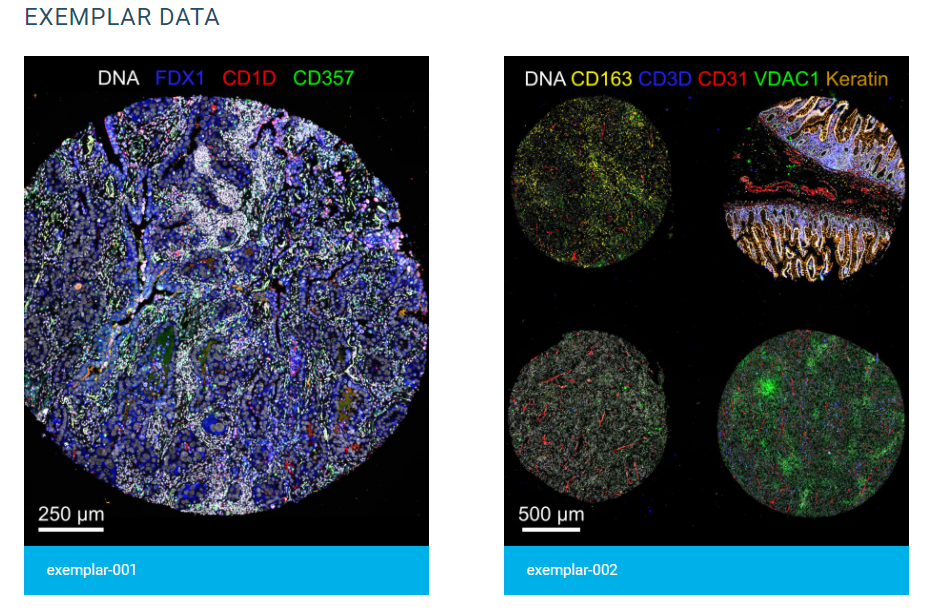

# Highlighted Stlying Elements
Stlying elements in this theme are well-documented. This page will highlight a few elements and UIs that may be the most relevant for your website and point to their documentations.

## Basic Grid

[See Documentation](https://labsyspharm.github.io/just-the-docs-lsp/docs/utilities/layout/#basic-grid){: .btn .btn-green }{:target="_blank"} 

The basic grid is an esay way to break away from the paragraph format and inject visual intrigue into your site's layout. It is also a great method of showing off parallel pieces of information. The results looks like this

Another exmaple of the use a basic grid is on the [Methodology](https://labsyspharm.github.io/blank-pub-microsite/methodology/){:target="_blank"} page of the blank website template.

## Enhanced Grid

[See Documentation](https://labsyspharm.github.io/just-the-docs-lsp/docs/utilities/layout/#enhanced-grid){: .btn .btn-green }{:target="_blank"} 

An enhanced grid allows you to customize the space designated to each element of the grid. It will automatically adjust to the screen size. 

An example is shown in the [Related Publication](https://labsyspharm.github.io/blank-pub-microsite/related-pubs.html#alternative-way){:target="_blank"} page on the blank website template.

## Image Cards

[See Documentation](https://labsyspharm.github.io/just-the-docs-lsp/docs/utilities/layout/#image-cards){: .btn .btn-green }{:target="_blank"} 

Image cards display a "thumbnail" for your link. It's a great way to provide a preview of where the link is leading to (e.g. if you were linking to image-based data)

Image cards look like this

## Buttons

[See Documentation](https://labsyspharm.github.io/just-the-docs-lsp/docs/ui-components/buttons/){: .btn .btn-green }{:target="_blank"} 

The above "See Documentation" is an example of a button! The style of the buttons are customizable. 

## Video Embedding

[See Documentation](https://labsyspharm.github.io/just-the-docs-lsp/docs/ui-components/video/){: .btn .btn-green }{:target="_blank"} 

You can embed a Youtube or Vimeo video in your website with autoplay option. 

An example can be seen on the [MCMICRO overview](https://mcmicro.org/overview/){:target="_blank"} page.
