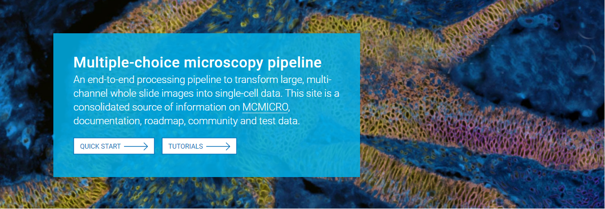
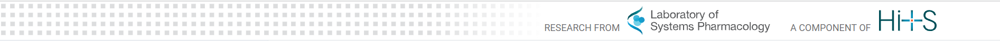

# LSP-specific Customizations
{: .no_toc }

<details open markdown="block">
  <summary>
    Table of contents
  </summary>
  {: .text-delta }
1. TOC
{:toc}
</details>

## Hero Banner

[Hero banner](https://jegra.github.io/just-the-docs/docs/ui-components/hero/) and text shows off your content immediately on the home page. It looks something like this:

<div class="row">

<div class="col-xs-12 col-sm-12">
<div markdown="1">

</div>
</div>

</div><!-- end grid -->

To make a hero graphic banner:
1. Add your image of choice to the repo. We suggest adding it to a central folder where you keep all images for the site (e.g. `assets/images/`). 
2. In `_config/yml` file, use the following line to embed hero image. Replace `DIRECTORY` to the path to your chosen image
    ```
    hero_background: "DIRECTORY"
    ```
    e.g. `hero_background: "/assets/images/hero_background.jpg"`
3. In the front matter of your home page, define the following values
    ```
    # Hero heading and body text
    hero_heading: "THIS IS THE HEADING"
    hero_body: "This is the body text."

    # Call to action(CTA) buttons to be displayed within the hero area
    # 'label', 'link', and 'target' values can be specified for each
    hero_ctas:
    - label: "button 1"
        link: "#getting-started"
    - label: "button 2"
        link: "http://github.com/"
        target: "_blank"

    # 'target' attribute specifies where to open the link. '_blank' opens a new tab, '_self' opens the link in the same tab etc. Default is opening in the same tab.
    ```

## Site Logo
[Sit logo](https://jegra.github.io/just-the-docs/docs/configuration/#site-logo) is set in `_config.yml` file by setting the path to the logo file. As an example:
```
logo: "/assets/images/just-the-docs.png"
```

## Top Banner Logos

[Top banner logos](https://jegra.github.io/just-the-docs/docs/configuration/#top-banner) of LSP and/or HiTS can be enabled in `_config.yml` file
```
banner_links:
    lsp: true
    hits: true
```
The results looks like this


## Footer

All content  in the [Footer](https://jegra.github.io/just-the-docs/docs/configuration/#footer-content) can be customized in the `_config.yml` file as well.
### Footer logos
Footer logos are set by a list of YAML values. Logo images are built into the theme and exist in the theme repository, so **you do not need to have these files in your website's repository**!

Current options of logos are HMS, LSP (two color options) and HiTS.
```
footer_logos:
  - name: "Laboratory of Systems Pharmacology"
    image: "/assets/images/logo_lsp_white.svg"
    url: "https://hits.harvard.edu/the-program/laboratory-of-systems-pharmacology/about/"
```

### Licenses

You can provide license information on your publication/software project in the footer. Licenses are set by a list of YAML value as well. This will allow you to put more than one licenses and specify which parts of the content they apply to.
```
# NOTE: By default, description text will be "[site title] is licensed under the"
license:
  - description: 
    name: "MIT License"
    url: "https://github.com/pmarsceill/just-the-docs/blob/master/LICENSE.txt"
  - description: "The code for [software name] is licensed under"
    name: "License ex2"
    url: "url-to-the-license-file"
```

### Other Footer Content
Other optional footer content includes a "Edit this page on GitHub"link and "Page Last Modified: DATE". Instructions on their customizations can be found on the [footer content documentation](https://jegra.github.io/just-the-docs/docs/configuration/#footer-content) as well.

