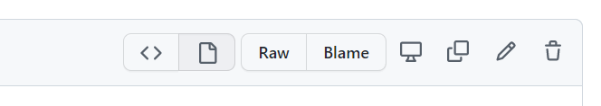

<details open markdown="block">
  <summary>
    Table of contents
  </summary>
  {: .text-delta }
1. TOC
{:toc}
</details>

# Adding pages on GitHub

Each Markdown file in the `docs` folder corresponds to a page in the final website. Adding and editing pages can be done directly in the GitHub repository. 

To add a page, follow these steps:

1. Navigate to `docs` folder and select **Add file** then **Create new file**


2. Make sure your new file name ends with the file extension `.md`. 
3. Your new page is now ready to be edited! I recommend writing a basic front matter to begin with: (`#` denotes commentary. What comes after `#` on the same line will not be executed)

```
---
Layout: default
# If you are working with the LSP-custom these (labsyspharm/just-the-docs-lsp), you should use the default layout option. If you are working with other themes, you should consult documentations of the theme for specific recommendations.
Title: Tutorials
# This page title will appear in navigation bar.
nav_order: 8
# nav_order determines the order this page shows up on the left side navigation bar. Pages are sorted from low to high nav_order. Numbers do not have to be consecutive.
---
```
Your other content should be written in Markdown below the `---` at the bottom of the front matter. More information on the front matter can be found [here](../yaml-basics.md).

# Editing pages on GitHub

To edit an existing page, open the Markdown file and start editing it by clicking the _pencil_ icon in the top right tool bar. 



**You can find resources to help you start writing in Markdown and YAML in the [Jekyll Formatting Basics](../formatting-basics.md) section.**

{: .fs-5 }
{: .fw-300 }
>Go back to Tutorial page to finish setting up your website.
>[Back to Tutorial](./tutorial.md){: .btn .btn-outline .btn-arrow }