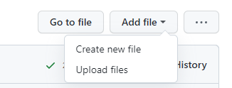

<details open markdown="block">
  <summary>
    Table of contents
  </summary>
  {: .text-delta }
1. TOC
{:toc}
</details>

{: .fw-300 }
Befor you start, makes sure you have a GitHub personal account. If you don't, follow [instructions here](../beforestart/before-start.md#github-account-setup) to obatin an account and gain permission to the LSP's organization on GitHub.

# Importing template repository on GitHub

1. Start a new repository under [**Laboratory of Systems Pharmacology @ Harvard**](https://github.com/labsyspharm). Choose _Import a repository_, on the right side of the title. For more information on the Import function, you can check out GitHub's [Documentaion](https://docs.github.com/en/github/importing-your-projects-to-github/importing-source-code-to-github/importing-a-repository-with-github-importer) on it.
2. Use the URL for the blank site template `https://github.com/labsyspharm/blank-method-microsite/` as _old repository's clone URL_ and set **labsyspharm** as the owner.

    

3. You should now have a copy of the blank website template in a new repository with *your website name*. 

More details on the blank website template and how to use it can be found on the [website template](./website-template/) page.

# Adding pages on GitHub

Each Markdown file in the `docs` folder corresponds to a page in the final website. Adding and editing pages can be done directly in the GitHub repository. 

To add a page, follow these steps:

1. Navigate to `docs` folder and select **Add file** then **Create new file**



2. Make sure your new file name ends with the file extension `.md`. 
3. Your new page is now ready to be edited! I recommend writing a basic front matter to begin with: (`#` denotes commentary. What comes after `#` on the same line will not be executed)

```
---
Layout: default
# If you are working with the LSP-custom these (labsyspharm/just-the-docs-lsp), you should use the default layout option. If you are working with other themes, you should consult documentations of the theme for specific recommendations.
Title: Tutorials
# This page title will appear in navigation bar.
nav_order: 8
# nav_order determines the order this page shows up on the left side navigation bar. Pages are sorted from low to high nav_order. Numbers do not have to be consecutive.
---
```
Your other content should be written in Markdown below the `---` at the bottom of the front matter. More information on the front matter can be found [here](./yaml).

# Editing pages on GitHub

To edit an existing page, open the markdown file and start editing it by clicking the _pencil_ icon in the top right tool bar. This tutorial website includes some [Markdown basic syntax](./markdown-basic) to get you started.

# Setting up GitHub pages

After you are happy with your site, you can set it up to be displayed:
1. Make sure your repository access is set to **public**. This can be changed under **Settings > Manage access**.
2. Within Settings, head over to **Pages** and change the default Source to the branch and folder where your website files are stored.
3. Click "Save" after configruing the source. A banner should show up to show that your website is "Your site is ready to be published at *url*" and eventually "your site is published at *url*" (This process might take a few minutes).


Now, if you head to the displayed *url*, you should see your finished website. 
