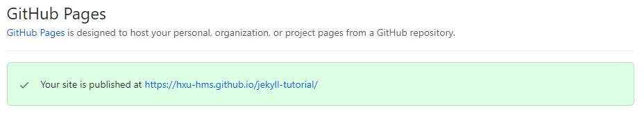

  

    Table of contents
  

  {: .text-delta }
1. TOC
{:toc}

# Setting up a GitHub account

To start off, since your website will be hosted by GitHub, you need a [personal GitHub account](https://docs.github.com/en/get-started/learning-about-github/types-of-github-accounts#personal-user-accounts). You can set one up at [GitHub](https://github.com/). Make sure this account is associated with an email that you check regularly. 

If you are a member of the Laboratory of Systems Pharmacology, please contact Jeremy Muhlich to be invited to join the **Laboratory of Systems Pharmaclogy @ Harvard** organization on GitHub.

# Importing template repository on GitHub

1. Start a new repository under [**Laboratory of Systems Pharmacology @ Harvard**](https://github.com/labsyspharm). Choose _Import a repository_, on the right side of the title. For more information on the Import function, you can check out GitHub's [Documentaion](https://docs.github.com/en/github/importing-your-projects-to-github/importing-source-code-to-github/importing-a-repository-with-github-importer) on it.
1. Use the URL for the blank site template `https://github.com/labsyspharm/blank-pub-microsite/` as _old repository's clone URL_ and set **labsyspharm** as the owner.

    

3. You should now have a copy of the blank website template in a new repository with your website name. 

# Adding and edting pages on GitHub

Each Markdown file in the `docs` folder corresponds to a page in the final website. Adding and editing pages can be done directly in the GitHub repository. 

To add a page, create a new file under `docs` folder and name it with the suffix `.md`. To edit an existing page, open the markdown file and start editing it by clicking the _pencil_ icon in the top right tool bar. This tutorial website includes some [Markdown basic syntax](./markdown-basic) to get you started.

More details on the blank website template and how to use it can be found on the [website template](./website-template/) page.

# Setting up GitHub pages

After you are happy with your site, you can set it up to be displayed:
1. Make sure your repository access is set to **public**. This can be changed under **Settings > Manage access**.
2. Within Settings, head over to **Pages** and change the default Source to the branch and folder where your website files are stored.
3. Click "Save" after configruing the source. A banner should show up to show that your website is "Your site is ready to be published at *url*" and eventually "your site is published at *url*" (This process might take a few minutes).

Now, if you head to the displayed *url*, you should see your finished website. 
